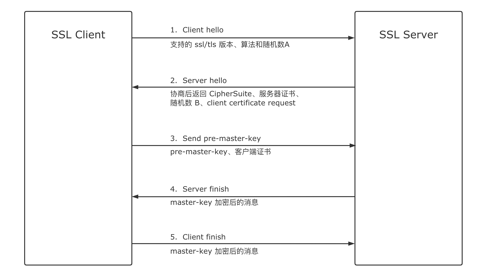
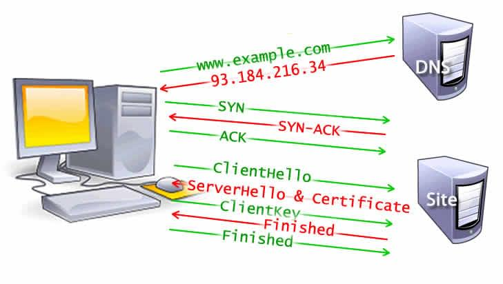
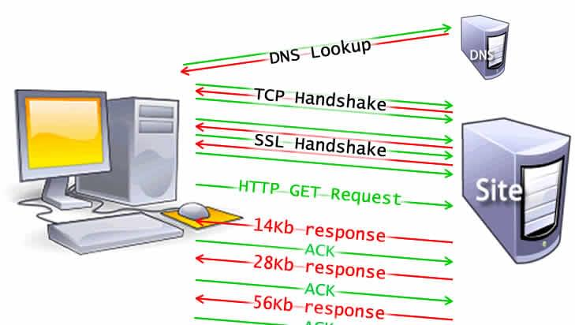

这是个老生常谈的经典问题，可以挖掘的知识有很多，从 DNS、TCP、HTTP 到浏览器渲染，基本涵盖了浏览器的方方面面，本文试图搞清楚其中的每一项。

## 1. URL

1. 浏览器首先判断输入的内容是不是合法的 URL 链接
2. 如果是，会判断输入的URL是否完整，不完整会补全
3. 不是，则搜索输入的内容

## 2. DNS（Domain Name System）

DNS 将域名解析为 IP 地址。

1. 首先查看**浏览器缓存和本地 hosts 文件**，如果有这个网址记录，则完成解析
2. 查找**系统 DNS 缓存**，如果有这个网址记录，则完成解析
3. 检查**本地 DNS 服务器缓存**，如果有这个网址记录，则完成解析（本地 DNS 服务器一般是 ISP， Internet Service Provider）
4. 本地 DNS 服务器发送查询报文至**根服务器**，根服务器返回对应的顶级域服务器地址
5. 本地 DNS 服务器发送查询报文到**顶级域服务器**，顶级域服务器返回权威服务器地址
6. 本地 DNS 服务器发送查询报文到**权威服务器**，权威服务器返回 IP 地址，完成解析

> 参考
> 1. https://howdns.works/ep1/
> 2. 世界上共有 13 个[根服务器](https://www.iana.org/domains/root/servers)
> 3. 各服务器含义：[根服务器, 顶级域服务器, 权威服务器](https://zh.wikipedia.org/wiki/%E5%90%8D%E7%A7%B0%E6%9C%8D%E5%8A%A1%E5%99%A8)
> 4. 本地 DNS 服务器在查询到一个新的记录时会进行缓存，避免下次重新查询

浏览器到本地 DNS 服务器时递归查询（即客户端只请求一次，只要求最后的结果），本地 DNS 服务器和其它服务器之间的查询属于迭代查询（即本地服务器请求一次，如果没有解决，则需要根据饭回的地址继续请求）。

在一次页面加载中，同一个主机地址，DNS 查找通常只会查询一次。如果页面中其他资源，图片、字体
脚本、广告等，是不同的主机地址，则会每一个都查询一次 DNS，这可能会影响性能。

## 3. 建立 TCP 连接

浏览器获取到 IP 之后，会用一个随机的端口（1024 < 端口 < 65535）向服务器 80/443 端口（HTTP 默认 80 端口，HTTPS 默认 443 端口）发起 TCP 连接请求。这个连接请求到达服务端后，经过 TCP 三次握手，建立 TCP 连接。

### TCP 三次握手

```jsx
  假设有客户端A，服务端B。我们要建立可靠的数据传输。
      SYN(=j)       // SYN: A 请求建立连接
  A ----------> B
                |
     ACK(=j+1)  |   // ACK: B 确认应答 A 的 SYN
     SYN(=k)    |   // SYN: B 发送一个 SYN
  A <-----------
  |
  |  ACK(=k+1)
   -----------> B   // ACK: A 确认应答 B 的包
```

1. 客户端向服务器发送 SYN 包（Seq=j），并进入 SYN_SEND 状态，等待服务器确认
2. 服务器收到 SYN 包，先应答客户端的 SYN（Ack=j+1），同时自己也发送一个 SYN 包(Seq=k)，服务器进入 SYN_RECV 状态
3. 客户端收到服务器的 SYN 包，向服务器发送确认包 ACK（Ack=k+1），发送完毕后，客户端和服务器进入 ESTABLISHED 状态，完成三次握手。

## 4. TLS 协商

如果使用的是 HTTPS 协议传输数据，会在 TCP 和 HTTP 之间多添加一层协议做加密和认证的服务。这一层就是 SSL（Secure Socket Layer） 和 TLS（Transport Layer Security）。

TLS 协商确定将使用哪个密码来加密通信，验证服务器，并在开始实际传输数据之前建立安全连接


   

在传输层经过 8 层往返后，终于可以传输数据了。



## 5. Response

浏览器和服务器的连接建立之后，浏览器会发送一个 HTTP GET 请求，请求目标通常是一个 HTML 文件。服务器响应文件内容。

> 拓展：
>
> Time to First Byte (TTFB) 是发出请求到收到第一个 HTML 数据包之间的时间。第一个内容数据块通常是 14kb 的数据。
>
> 第一个响应包为 14Kb 是 TCP slow start（TCP 慢启动） 的一部分，慢启动会逐渐增加传输的数据量，直到可以确定网络的最大带宽。
>
> 在 TCP 慢启动中，在收到初始数据包后，服务器将下一个数据包的大小加倍到 28Kb 左右。后续数据包的大小会增加，直到达到预定阈值或遇到拥塞。
>
> 当服务器以 TCP 数据包的形式发送数据时，用户的客户端通过返回确认或 ACK 来确认交付。
> 

## 6. Parsing

浏览器收到响应之后，开始 parse-style-layout-paint-composite 流程。

## 7. TCP 断开连接

现代浏览器为了加快请求速度，默认都会开启持久链接（keep-live），当 tab 标签页关闭时，TCP 连接确认关闭。关闭的过程就是**四次挥手**。

1. 客户端向服务器发送一个 FIN（Seq=u），表示要关闭数据传送
2. 服务器收到 FIN 后，响应一个确认信号 ACK（Ack=u+1）
3. 服务器发送一个 FIN（Seq=w），表示自己也要关闭数据传送
4. 客户端收到 FIN 后，响应一个确认信号 ACK（Ack=w+1），至此四次挥手完毕。


> 参考：
>
> 1. https://febook.hzfe.org/awesome-interview/book1/topic-enter-url-display-xx
> 2. https://developer.mozilla.org/en-US/docs/Web/Performance/How_browsers_work
