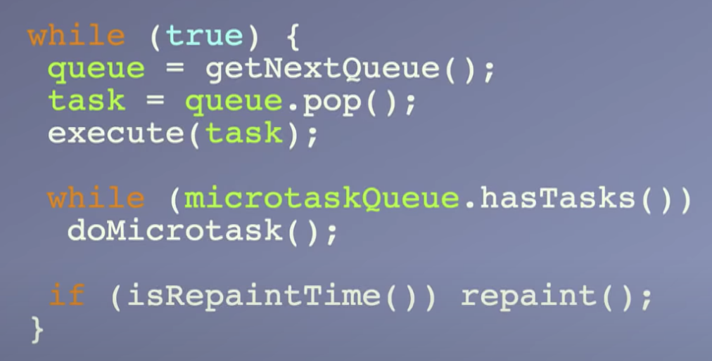
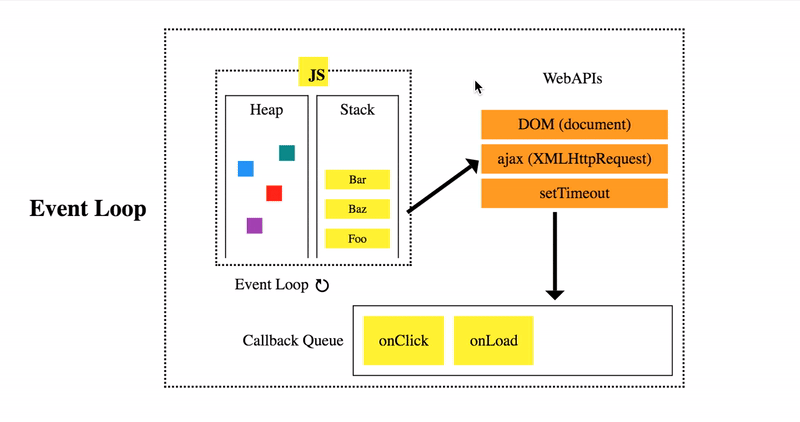

## Event Loop

事件循环是一个无限循环，每当有新事件触发时，就进入这个循环。

浏览器事件循环是以浏览器为宿主环境实现的事件调度，操作顺序如下：

1. 执行一个任务
2. 执行过程中如果遇到 promise 等微任务，就将它加入到微任务队列，如果遇到其它非同步代码，浏览器会在需要执行它们时，将它们加入任务队列，等待下一次循环
3. 当前任务执行完毕后，立即执行当前微任务队列中的所有微任务（依次执行）。如果微任务中还有微任务，将继续放入微任务队列，它们将全部执行，直到微任务队列清空
4. 当前任务执行完毕，开始检查渲染，然后渲染线程接管进行渲染
5. 渲染完毕后，JS 线程继续接管，开始下一个循环

伪代码实现：

> 图片来源： [JSConf EU 2018](https://www.youtube.com/watch?v=u1kqx6AenYw)

另一个示意图：

- JS 块表示当前的执行栈
- WebAPIs 表示处理 webApi 代码，当同步代码中碰到 ajax，setTimeout 等操作，会将它们放入这里（这部分包含定时器线程、事件线程、http请求线程等），然后在需要执行回调时，放入任务队列
- Callback Queue 表示任务队列，在执行栈空时，选择第一个任务执行

> 图片来源： [JSConf EU 2014](https://www.youtube.com/watch?v=8aGhZQkoFbQ)

微任务包含：Promises, queueMicrotask, MutationObserver

## 为什么需要事件循环

JS 执行是单线程，如果异步操作阻塞了 JS 的执行，会造成**浏览器假死**，影响其它线程（主要是 GUI 渲染线程）的执行。事件循环引入的事件队列，使得异步任务可以非阻塞的执行。

## Node 中的事件循环

https://nodejs.org/en/docs/guides/event-loop-timers-and-nexttick/#what-is-the-event-loop
