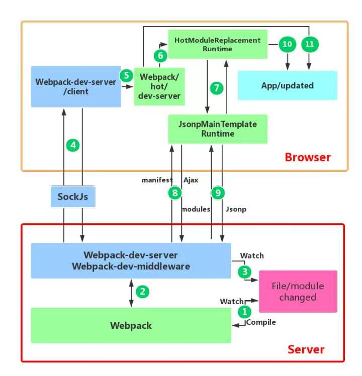

Webpack 是一个静态模块打包器。

## 核心概念

  Webpack 由配置驱动，配置主要写在一个配置文件中，这个配置文件就是一个遵循 CommonJS 模块规范的 JS 文件，导出一个配置对象。以下是配置对象中主要使用的属性。

### Entry

  指示 webpack 构建依赖图的入口模块。

  ```jsx
    module.exports = {
      entry: './path/to/my/entry/file.js',
    };
  ```

  默认是 `./src/index.js`。

  #### 详解

  在 webpack 中有多种方式配置 entry 属性。

  1. **单入口语法**

  `entry: string | [string]`

  单一个字符串就是上面的写法，也可以传入包含多个文件路径的数组。数组写法会将多个依赖文件一起注入到一个 `chunk` 。

  2. **对象语法**

  `entry: { <entryChunkName> string | [string] } | {}`

  ```jsx
    module.exports = {
      entry: {
        app: './src/app.js',
        adminApp: './src/adminApp.js',
      },
    };
  ```

  对象语法比较繁琐，但是可扩展性更高。对象可定义的属性如下：
  - `dependOn`: 当前入口依赖的入口点，必须在当前入口点之前加载它们
  - `filename`: 定义每一个输出文件的名称
  - `import`: 启动时加载的模块
  - `library`: 定义库选项，以从当前入口点打包一个库，参考 output.library
  - `runtime`: 运行时块的名称。当设置时，会为当前入口创建一个新的运行时块（runtime chunk，指执行一个模块所需要的 webpack runtime 代码，单独打包可以让浏览器长缓存，参考 optimization.runtimeChunk）
  - `publicPath`: 定义当前入口点的公共路径，参考 output.publicPath

  使用参数几个需要注意的地方：
  - `runtime` 和 `dependOn` 不能同时使用。
  - `runtime` 不能是已存在的入口的名称
  - `dependOn` 入口点不能循环引用

---

  3. **使用场景 Scenarios**

  > https://webpack.js.org/concepts/entry-points/#scenarios

  - 分离 app(应用程序) 和 vendor(第三方库) 入口
  - 多页面应用

### Output

  告诉 webpack 在哪里存放创建的包和如何命名它们。

  ```jsx
    const path = require('path');

    module.exports = {
      entry: './path/to/my/entry/file.js',
      output: {
        path: path.resolve(__dirname, 'dist'),
        filename: 'my-first-webpack.bundle.js',
      },
    };
  ```

  默认是 `./dist/main.js`

  #### 详解

  output 属性是一个对象，常用属性如下：
  - `path`: 存放打包文件的目录
  - `filename`: 打包文件的名称，如果不指定 `filename`，webpack 会使用 `entry` 的名称作为文件名
  - `publicPath`: 请求资源的路径。如果在编译时还不知道 `publicPath`，它可以留空并在运行时通过入口点文件中的 `__webpack_public_path__` 变量动态设置

  多入口点的情况下，可以使用 `[name]` 来指定每个入口点的名称。

  ```jsx
    module.exports = {
      entry: {
        app: './src/app.js',
        search: './src/search.js',
      },
      output: {
        filename: '[name].js',
        path: __dirname + '/dist',
      },
    };
    // writes to disk: ./dist/app.js, ./dist/search.js
  ```

### Loaders

  Webpack 默认只能识别 JS 和 JSON 文件，loaders 赋予了 webpack 处理其他类型文件的能力。

  Loaders 有两个属性：
  - `test`: 表示哪个文件或文件夹应该被转换
  - `use`: 表示使用哪个 loader 做转换

  ```jsx
    const path = require('path');
    module.exports = {
      output: {
        filename: 'my-first-webpack.bundle.js',
      },
      module: {
        rules: [{ test: /\.txt$/, use: 'raw-loader' }],
      },
    };
  ```

  #### 详解

  Loader 有两种使用方式：
  1. **配置**

  就是上面的那种配置方式，在 `module.rules` 中指定，`use` 包含为数组时，loaders 从右向左执行（从下向上）执行

  2. **内联**

  在 `import` 语句中（或其它模块的引入语法）定义。不常用，推荐使用配置方式。

  ```jsx
    import Styles from 'style-loader!css-loader?modules!./styles.css';
  ```


### Plugins

  Loaders 用来处理具体类型的模块，plugins 用来执行更宽泛的作用，比如包优化，资源管理和环境变量注入等。

  插件是 webpack 的支柱。Webpack 本身就建立在配置中使用的相同插件系统上！

  ```jsx
    const HtmlWebpackPlugin = require('html-webpack-plugin'); //installed via npm
    const webpack = require('webpack'); //to access built-in plugins
    module.exports = {
      module: {
        rules: [{ test: /\.txt$/, use: 'raw-loader' }],
      },
      plugins: [new HtmlWebpackPlugin({ template: './src/index.html' })],
    };
  ```

  #### 详解

  Webpack 插件是一个有 apply 方法的对象，这个方法在编译时被 webpack 调用。

  ```jsx
    const pluginName = 'ConsoleLogOnBuildWebpackPlugin';

    class ConsoleLogOnBuildWebpackPlugin {
      apply(compiler) {
        compiler.hooks.run.tap(pluginName, (compilation) => {
          console.log('The webpack build process is starting!');
        });
      }
    }

    module.exports = ConsoleLogOnBuildWebpackPlugin;
  ```

  插件可以接收参数，所以必须通过 `new` 创建一个实例，再把实例传给 plugins 属性。

  使用方式：
  1. **配置**

  ```jsx
    const HtmlWebpackPlugin = require('html-webpack-plugin'); //installed via npm
    const webpack = require('webpack'); //to access built-in plugins

    module.exports = {
      // ...
      plugins: [
        new webpack.ProgressPlugin(),
        new HtmlWebpackPlugin({ template: './src/index.html' }),
      ],
    };
  ```

  2. **Node API**

  ```jsx
    const webpack = require('webpack'); //to access webpack runtime
    const configuration = require('./webpack.config.js');

    let compiler = webpack(configuration);

    new webpack.ProgressPlugin().apply(compiler);

    compiler.run(function (err, stats) {
      // ...
    });
  ```

### Mode

  Mode 可以设置为 `development`, `production` 或 `none`，进而使用 webpack 内置的对应每个模式的优化。默认是 `production`。

## 其它概念

### Modules

  模块化编程中，开发者将程序分解成多个块，各司其职。

  Webpack 原生支持的模块类型如下：
  - ES6
  - CommonJS
  - AMD
  - Assets: webpack 5 新增的模块类型，用于处理非 JavaScript 文件，比如图片、字体、视频等
  - WebAssembly

  除此之外，其他类型模块可以通过 loader 支持。

### Module Federation 模块联邦

  实现跨应用代码共享

### Targets

  打包目标环境，比如 `web`, `node` 或 `electron`。支持多目标打包。

### Manifest

  由 webpack 构建的应用，有三种主要代码类型：
  - 自己写的代码
  - 依赖库的代码
  - webpack 运行时和 manifest

  Webpack 使用 manifest 管理模块间的交互，Manifest 包含了模块信息，被用来解析加载模块。

### Sourcemap

源映射由一大堆信息组成，这些信息可用于将压缩文件中的代码映射回其原始源。
https://blog.teamtreehouse.com/introduction-source-maps

### Hot Module Replacement

  热模块替换，会在应用程序运行过程中，替换、添加或删除 模块，而无需重新加载整个页面。它可以：
  - 保留页面状态
  - 节省开发时间
  - 修改实时更新，比如更改样式几乎和在浏览器开发工具中修改体验一直，且不会丢失

  HMR 原理：
  
  Websocket 和客户端通信，编译完成时通知客户端，客户端向 dev-server 请求模块列表，客户端比对后，再请求更新后的模块，完成更新或重载。

  

  客户端模块热更新之后，再搭配上 react-fresh 动态更新状态即可。

  > react-fresh: https://github.com/facebook/react/issues/16604#issuecomment-528663101

## Webpack 工作流程

webpack 核心任务是完成内容转化和资源合并。主要包含 3 个阶段：

  1. 初始化阶段

     - **初始化参数**：从配置、shell 参数读取合并成最终配置
     - **创建编译对象**：用上一步的参数创建 Compiler 对象
     - **初始化编译环境**：包括注入内置插件、注册自定义插件、注册各种模块工厂等

  2. 构建阶段

     - **开始编译**：执行 Compiler 对象的 run 方法，创建 Compilation 对象
     - **确认编译入口**：读取配置的 Entries，递归遍历所有的入口文件
     - **编译模块**：开始构建，从入口文件开始，调用 loader 对模块进行转译处理，然后调用 JS 解析器（acorn）将内容转换为 AST，然后递归分析依赖，依次处理全部文件
     - **完成模块编译**：在上一步处理好所有模块之后，得到模块编译产物和依赖关系图

  3. 生成阶段

     - **输出资源**：根据入口和模块之间的依赖关系，组装成多个包含多个模块的 chunk，再把每个 chunk 转换成一个 asset 加入到输出列表，这里是可以修改输出内容的最后机会
     - **写入文件系统**：根据配置的 output 属性，将内容写入文件系统

## Webpack loader 机制

  一个 loader 就是一个导出函数的 node 模块，这个函数会在一个资源需要被此 loader 转换时调用。

  Loader 返回可以被 webpack 处理的模块。

  > TODO https://webpack.js.org/contribute/writing-a-loader/

## 常见问题

1. contentHash 和 chunkHash 有什么区别


## 常见 loader

1. style-loader

  将 css 注入到 DOM 中，通过 \<style\> 标签。开发模式下推荐使用，比 MiniCssExtractPlugin 更快。
2. css-loader

  加载 css，解析 css 文件中的 @import 和 url()，返回 css 代码。

3. postcss-loader

  使用 postcss 转换 css 文件。

4. sass-loader

  将 sass/scss 编译为 css。

5. babel-loader

  使用 babel 编译 JS。

  配合套件：babel-loader @babel/core @babel/preset-env @babel/preset-react

  babel polyfill 有两种方案：  
     1. preset-env + corejs，在 useBuiltIns 设置
     2. preset-env + transform-runtime + runtime-corejs3

## 常见 plugin

1. MiniCssExtractPlugin

  将 css 提取到单独文件中。

2. HtmlWebpackPlugin
3. TerserPlugin

  压缩/最小化 JS，可以移除注释，解析代码到固定版本

4. CssMinimizerPlugin

  压缩 css

## 提高 webpack 构建性能

1. 使用高版本的 webpack 和 nodejs
2. 在最小模块范围内使用 loader，尽量使用 include/exclude 缩小范围
3. 持久化缓存——cache filesystem 来缓存模块，提升二次构建速度，首次构建时间有略微增加，二次构建时间将大幅减少
4. 多进程构建 thread-loader

### 开发环境下的优化

1. 增量构建，使用 watch 配置
2. 在内存中编译，webpack-dev-server 在内存中编译和提供资源而不是写入磁盘来提高性能
3. 避免在生产环境中使用的插件，比如压缩插件，在开发环境没必要使用

## Webpack 优化策略

1. JS、CSS 压缩
2. 代码分割  
Webpack 中的代码分割分为三种情况：多入口分包、依赖分包和动态引入分包。属于优化的主要是后两种。  

   1. 依赖分包

        通过 optimization.splitChunks 配置项，将第三方依赖和共享模块拆分成单独的包，便于浏览器缓存。  
        splitChunks 默认配置：https://webpack.js.org/plugins/split-chunks-plugin/#optimizationsplitchunks  
        cacheGroups 默认定义了 defaultVendors 和 default 两个选项，分别拆分 node_modules 中的包和最少两个 chunk 共享的模块。defaultVendors 优先级更高。

   2. 动态引入分包

        Webpack 默认提供懒加载（Lazy-load）部分的代码分离。修改 output.chunkFilename 可以自定义懒加载包的名字。

        使用 `React.lazy` 搭配 `react-router` 可以启用懒加载功能。

3. webpack runtime chunk 分包
   
  Webpack 会将一小段运行时代码放入最后打的那个包中。每次构建完，这小段代码会变，导致最后的包即使本身没发生变化，它的名字也会改变，这样不利于使用强缓存，所以我们将 runtimeChunk 也分离出来。通过 optimization.runtimeChunk 配置。

  再进一步，可以将这一小段代码放入 script 标签中，节省一次 http 请求。

  > 参考：https://developers.google.com/web/fundamentals/performance/webpack/use-long-term-caching#inline_webpack_runtime_to_save_an_extra_http_request

4. prefetch/preload link：https://webpack.js.org/guides/code-splitting/#prefetchingpreloading-modules

5. tree-shaking

  Tree shaking 功能依赖于 ESM 代码可以静态分析。

  开启：
  - 使用 ESM
  - 确保没有其它插件将代码转换为 CommonJS 代码
  - 在 package.json 中添加 sideEffects 字段
  - mode 配置设置为 production

6. 静态资源上传 CDN
