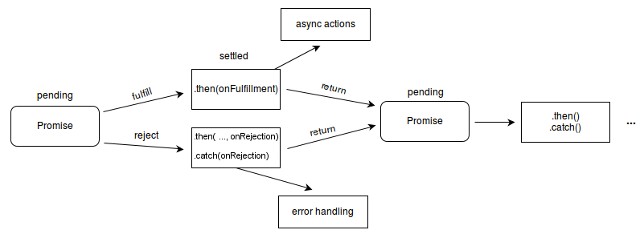

Promise 表示一个异步操作的最终完成或失败和它的结果值。

## 介绍

Promise 用来处理不需要立即得到结果的异步操作，还可以用一些方法作为回调处理执行的结果。

一个 Promise 一定处于以下状态之一：pending、fulfilled、rejected。当状态从 pending 变为另两种时，可以使用 `promise.then() promise.catch() promise.finally()` 做下一步的处理。

```jsx
  const myPromise = new Promise((resolve, reject) => {
    setTimeout(() => {
      resolve('foo');
    }, 300);
  });

  myPromise
    .then(handleResolvedA, handleRejectedA)
    .then(handleResolvedB, handleRejectedB)
    .catch(handleRejectedC);
    .finally()
```

每一次调用返回的都是一个新的 promise 对象。

链式 promise 示意图👇



## Constructor

Promise 构造函数主要用于包裹不支持 promise 的函数，使他变为一个 promise 对象。

`new Promise(executor)`

executor 函数签名:

```jsx
  function (resolutionFunc, rejectionFunc) {
    // 异步操作
  }
```

promise 执行成功时，调用 `resolutionFunc(value)`，失败时，调用 `rejectionFunc(value)`。Promise 状态相应的变为 `fulfilled` 和 `rejected`。

如果传入 `resolutionFunc` 的是一个 promise，那么它会动态替换当前的 promise 继续执行。

关于 executor 还有两个特性：

- executor 函数返回值会被忽略
- executor 内抛出错误，promise 会变为 rejected 状态
  
  > 注意：如果是在 setTimeout 等异步中抛出的错误，不会改变状态，且不会触发 catch

  > ```jsx
  >   // Errors thrown inside asynchronous functions will act like uncaught errors
  >   var p2 = new Promise(function(resolve, reject) {
  >     setTimeout(function() {
  >       throw new Error('Uncaught Exception!');
  >     }, 1000);
  >   });
  >
  >   p2.catch(function(e) {
  >     console.error(e);  // This is never called
  >   });
  > ```


## 静态方法

- ### Promise.all(iterable)

  返回值

  - 传入的 iterable 对象为空，返回一个**已经 resolved** 的 promise。值是一个空数组
  <!-- - 传入的 iterable 对象内不包含 promise 对象，返回一个**异步 resolved** 的 promise -->
  - 其它都返回一个 **pending 的 promise**。返回值的顺序和传入的顺序一致。

  ```jsx
    var p = Promise.all([]); // will be immediately resolved
    var p2 = Promise.all([1337, "hi"]); // non-promise values will be ignored, but the evaluation will be done asynchronously
    var p3 = [Promise.resolve(33), Promise.resolve(44)]; // asynchronously
    console.log(p); // 同步变为 fulfilled
    console.log(p2); // 异步，pending
    console.log(p3); // 异步，pending
    setTimeout(function() {
        console.log('the stack is now empty');
        console.log(p2); // fulfilled
        console.log(p3); // fulfilled
    });
  ```

  `Promise.all()` 的参数只要有一个 rejected，就会变为 rejected 状态。这里有一个小技巧改变这种行为，使它在有 rejected 的情况下也可以全部执行完毕。
  
  ```jsx
    var p1 = new Promise((resolve, reject) => {
      setTimeout(() => resolve('p1_delayed_resolution'), 1000);
    });
    var p2 = new Promise((resolve, reject) => {
      reject(new Error('p2_immediate_rejection'));
    });

    Promise.all([
      p1.catch(error => { return error }),
      p2.catch(error => { return error }),
    ]).then(values => {
      console.log(values[0]) // "p1_delayed_resolution"
      console.error(values[1]) // "Error: p2_immediate_rejection"
    })
  ```

  `Promise.all()` 如果有一个变为了 rejected 状态，它会立即返回一个 `rejected` promise，不会等待其它 promise 执行完毕。否则，等待全部确认结果后返回。

- ### Promise.allSettled(iterable)

  > [ES2019 新增](https://github.com/tc39/proposals/blob/HEAD/finished-proposals.md)

  和 `Promise.all()` 不同点在于，allSettled 在输入的 promise 状态确定时，无论结果是 fulfilled 还是 rejected，allSettled 返回的 promise 的状态就会变为 fulfilled。

  返回值是一个数组，包含对应参数数量的对象，每个对象包括一个 status 属性，表示 promise 的执行结果，包括一个 value/reason，分别代表 fulfilled 的值和 rejected 的理由。

- ### Promise.any(iterable)

  > [ES2020 新增](https://github.com/tc39/proposals/blob/HEAD/finished-proposals.md)

  返回一个 promise，当 iterable 中的任意一个 promise 变为 fulfilled 时，它会立即变为 fulfilled，同时值就是此 promise 的值。

  - 如果传入一个空的 iterable 对象，同步返回一个已经 rejected promise，错误类型为 AggregateError
  - 其它都返回一个 pending promise，取决于执行结果

- ### Promise.race(iterable)

  返回一个 promise，当 iterable 中的任意一个 promise 状态确定(fulfilled/rejected)时，它会立即变为相应的状态，同时值就是此 promise 的值/理由。

  - 如果传入一个空的 iterable 对象，返回一个永远为 pending 状态的 promise。
  - 其它都返回一个 pending promise。如果传入的 iterable 包含非 promise 值或已经确定状态的 promise，那么按顺序返回 值为第一个的 promise。

  和 `Promise.any` 区别

  - race 关心**第一个确定状态**的 promise，无论是 fulfilled 还是 rejected
  - any 关心**第一个 fulfilled** 的promise

- ### Promise.reject(reason)

  返回一个 rejected 的 promise 对象，值为传入的 reason

- ### Promise.resolve(value)

  返回一个 fulfilled 的 promise 对象，值为传入的 value。

  如果传入的是 promise，那么会返回这个 promise

  ```jsx
    var original = Promise.resolve(33);
    var cast = Promise.resolve(original);
    console.log(original === cast); // true
  ```

  如果传入一个 thenable 的对象，返回的 promise 会使用 then 方法，采用它的最终状态。

  ```jsx
    // Resolving a thenable object
    var p1 = Promise.resolve({
      then: function(onFulfill, onReject) { onFulfill('fulfilled!'); }
    });
    console.log(p1 instanceof Promise) // true, object casted to a Promise

    p1.then(function(v) {
        console.log(v); // "fulfilled!"
      }, function(e) {
        // not called
    });
  ```

  值得注意的是，`Promise.resolve`会尝试展开嵌套的 promise-like 对象，取最终的值。

  `Promise.resolve` 和 `Promise.reject` 两个方法都是同步创建一个确定状态的 promise，但是他们还是异步执行的。考虑以下代码：

  ```jsx
    try {
      Promise.reject(new Error('error'))
    } catch (e) {
      console.log(e)
    }
  ```

  try/catch 并不能捕获抛出的错误，就是因为 promise 本质上是异步执行的。虽然同步创建了一个 rejected promise，但是只是同步改变了状态，执行仍然是异步的。所以这里使用同步的方式捕获不到，改为下列方式可以正确捕获：

  ```jsx
    async function catchError() {
      try {
        await Promise.reject(new Error('error'))
      } catch (e) {
        console.log(e)
      }
    }
  ```

## 实例方法

- ### Promise.prototype.then()

  `.then()` 方法接受两个函数类型的参数，第一个在 promise 变为 fulfilled 时执行，第二个在 promise 变为 rejected 时执行。`.then()` 返回一个新的 promise 对象，即使 `.then()` 没有传入处理函数。

  `p.then(onFulfilled[, onRejected]);`，两个参数都是可选的。如果一个或两个参数未传，或者为非函数，那么返回的 promise 会采用调用 then 的原始 promise 的状态，值也为原值。

  返回值

  then 处理函数的返回值有多种情况：

  - 返回一个值。返回一个 resolved promise，值为处理函数返回的值。
  - 没有返回。返回一个 resolved promise，值为 undefined。
  - 抛出错误。返回一个 rejected promise，值为抛出的错误。
  - 返回一个 fulfilled promise。返回一个 fulfilled promise，值为处理函数返回的 promise 的值。
  - 返回一个 rejected promise。返回一个 rejected promise，值为处理函数返回的 promise 的值。
  - 返回一个 pending promise。then 返回的 promise 会在处理函数返回的 promise 确定状态之后再确定，而且它的状态取决于后者。值也是后者的值。
    ```jsx
      Promise.resolve(111).then(() => {
        return new Promise((resolve, reject) => {
          setTimeout(()=>{
            console.log('handler resolved');
            resolve(222)
          }, 2000)
        })
      }).then(res => {
        console.log('then resolved', 222); 
      })
      // 输出:
      // handler resolved
      // then resolved 222
    ```

  需要注意的是，上面描述返回 promise 的状态都是最终状态。then 方法本身是异步的，它立即返回的 promise 永远是 pending。如下所示：

  ```jsx
    // using a resolved promise, the 'then' block will be triggered instantly,
    // but its handlers will be triggered asynchronously as demonstrated by the console.logs
    const resolvedProm = Promise.resolve(33);

    let thenProm = resolvedProm.then(value => {
        console.log("this gets called after the end of the main stack. the value received and returned is: " + value);
        return value;
    });
    // instantly logging the value of thenProm
    console.log(thenProm);

    // using setTimeout we can postpone the execution of a function to the moment the stack is empty
    setTimeout(() => {
        console.log(thenProm);
    });

    // logs, in order:
    // Promise {[[PromiseStatus]]: "pending", [[PromiseValue]]: undefined}
    // "this gets called after the end of the main stack. the value received and returned is: 33"
    // Promise {[[PromiseStatus]]: "resolved", [[PromiseValue]]: 33}

    // 另一个例子
    let b = resolvedProm.then(() => {
        return Promise.resolve(111)
    })
    console.log(b)
    setTimeout(() => {
        console.log(b)
    })
    // Promise {[[PromiseStatus]]: "pending", [[PromiseValue]]: undefined}
    // Promise {[[PromiseStatus]]: "resolved", [[PromiseValue]]: 111}
  ```

- ### Promise.prototype.catch()

  `.catch()` 处理 promise 的 rejected 状态，等同于 `Promise.prototype.then(undefined, onRejected)`。实际上其内部也是调用的 `obj.then(undefined, onRejected)`(佐证: [Demonstration of the internal call](https://developer.mozilla.org/en-US/docs/Web/JavaScript/Reference/Global_Objects/Promise/catch#return_value))。
  
  使用 `.catch()` 避免了在每一个 then 中加上可能用不到的异常处理参数，可以让 promise 直到在遇到 catch 时再处理错误，某种情况下让 promise 看起来更加简洁。

- ### Promise.prototype.finally()

  > [ES2018 新增](https://github.com/tc39/proposals/blob/HEAD/finished-proposals.md)

  返回一个 promise。finally 的处理函数不会接受任何参数。

  - 处理函数中抛出错误或返回一个 rejected promise，finally 会返回一个 rejected promise。
  - 其它情况，返回的 promise，状态是原始 promise 的状态，值是原始 promise 的值。

## async await (ES2017)

async/await 使用更简洁的方式启用异步操作。简化了使用 promise API 时必要的语法。

### async

返回值

一个 resolved promise，或者当函数内部有未捕获的 rejected promise 和抛出异常时，返回一个 rejected promise。

```jsx
// 函数签名
async function name([param[, param[, ...param]]]) {
   statements
}

async function foo() {
  return 1
}
// 略等于
function foo() {
   return Promise.resolve(1)
}
// PS: 略等，是因为假如返回一个 promise 时，async 函数返回的是一个新的 promise，而 Promise.resolve() 返回的是同一个 promise。
```

async 函数体可以根据 await 表达式，分割为1个或多个部分。如果函数体内没有 await 表达式，这个 async 函数是同步执行的。如果有 await 表达式，函数体从最顶层代码到第一个 await 表达式(包括此表达式)是同步执行的，剩余部分异步执行。

只要 async 函数体内存在一个 await 表达式，它就是**异步**执行完成的。看以下代码：

```jsx
  async function foo() {
    await 1 //  仍然是异步返回的
  }
  // 等于
  async function foo() {
    return Promise.resolve(1).then(() => undefined)
  }
```

### await

只能在 async 函数内使用。

`[rv] = await expression`

如果表达式不是 promise，它会转换成一个 resolved promise，指为表达式本身。

## 相关知识

https://developer.mozilla.org/en-US/docs/Web/JavaScript/Guide/Using_promises
### 浏览器中的事件循环
https://developer.mozilla.org/en-US/docs/Web/API/HTML_DOM_API/Microtask_guide

### 实现 promise

1. 手写 `Promise.all()`

all 方法主要做了 2 件事：

- 返回一个 promise
- 分别处理 reject 和 resolve 情况

再加上边缘情况：

- 判断传入参数是否可迭代
- 空 iterator，resolve 返回空数组
- 处理非 promise 类型

```jsx
  function promiseAll(args) {
    // 不是可迭代对象抛出错误
    const type = Object.prototype.toString.call(args).slice(8, -1).toLowerCase()
    const isIterable = ((type === 'object' && args !== null) || type === 'string') && typeof args[Symbol.iterator] === 'function'
    if (!isIterable) {
      throw new TypeError(`${type} is not iterable`)
    }

    args = Array.from(args)
    let resolvedCount = 0
    const result = []
    return new Promise((resolve, reject) => {
      // 空 iterator，resolve 返回空数组
      if (!args.length) {
        resolve([])
      }

      args.forEach((arg, index) => {
        //使用 Promise.resolve 包裹，处理非 promise 类型
        Promise.resolve(promise).then((res) => {
          resolvedCount++
          result[index] = res
          if (resolvedCount === args.length) {
            resolve(result)
          }
        }).catch(res = {
          reject(res)
        })
      })
    })
  }
```

### 一个吊诡的问题

  ```jsx
    Promise.resolve()
    .then(() => {
      console.log("then1");
      Promise.resolve()
        .then(() => {
          console.log("then1-1");
          return Promise.resolve(1111);
        })
        .then(() => {
          console.log("then1-2");
        });
    })
    .then(() => {
      console.log("then2");
    })
    .then(() => {
      console.log("then3");
    })
    .then(() => {
      console.log("then4");
    }).then(() => {
      console.log("then5");
    });

    // then1
    // then1-1
    // then2
    // then3
    // then4
    // then1-2
    // then5
  ```

### async 一个值得注意的问题

https://developer.mozilla.org/en-US/docs/Web/JavaScript/Reference/Statements/async_function#:~:text=For%20example%2C%20in,swallow%20all%20errors...

1. 虽然数组内加上了 await，但是不会等第一个resolved之后，再执行第二个，如下代码所示：

  ```jsx
    async function test() {
        var p1 = new Promise((resolve, reject) => {
          console.log(111)
          setTimeout(() => {console.log(1);reject('one')}, 1000);
        });
        var p2 = new Promise((resolve, reject) => {
          console.log(222)
          setTimeout(() => {console.log(2);resolve('two')}, 2000);
        });
        var p3 = new Promise((resolve, reject) => {
          setTimeout(() => {console.log(3);resolve('three')}, 3000);
        });
        var p4 = new Promise((resolve, reject) => {
          setTimeout(() => {console.log(4);resolve('four')}, 4000);
        });

        // Using .catch:
        var a = [await p4, await p3, await p2, await p1]
        console.log(a)
    }
  ```

  先打印 111 222，再打印 1 2 3 4
