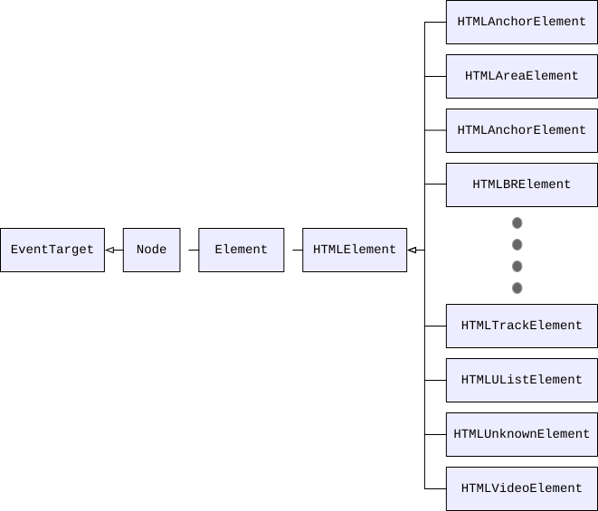

DOM -- Document Object Module，文档对象模型。表示文档的结构并与之交互的接口。文档包括 HTML、XML、SVG 等，这里主要学习的是 HTML 部分。

## HTML DOM API 介绍

由定义 HTML 中每个元素功能的接口组成。包括以下几项：

  1. 连接和控制元素
  2. 连接和操作表单数据
  3. 与 2D 图像和 canvas 交互
  4. 管理连接到 audio/video 的媒体
  5. 拖放内容
  6. 连接浏览器导航历史
  7. 其它 API（Web Components, Web Storage, Web Works, WebSocket, Server-sent events）

往下进行之前，先明确几个概念。

### Node
节点接口，所有 DOM 节点都继承自 Node 类型。它包含了所有节点共享的属性和方法。

- ### Document

表示任何文档的接口。定义了多种文档通用的属性、方法和事件。

`EventTarget <-- Node <-- Document`

- ### HTMLDocument

表示 HTML 文档。可以看作是 Document 的别名，HTMLDocument 是基于 Document 的。

document 是 HTMLDocument 的实例，表示整个 HTML 页面。document 是 window 对象的属性。

`EventTarget <-- Node <-- Document <-- HTMLDocument`

- ### Element

Document 中所有元素对象从该类继承。定义了各元素通用的属性、方法和事件。

`EventTarget <-- Node <-- Element`

- ### HTMLElement

继承自 Element 接口，并增加了一些属性。HTML 元素从 HTMLElement 继承。

`EventTarget <-- Node <-- Element <-- HTMLElement`

HTML 中特定元素都继承自 HTMLElement，如下图所示:

这些特定元素接口组成了 HTML DOM API 的大部分内容。

## HTML DOM API 内容

> https://developer.mozilla.org/en-US/docs/Web/API/HTML_DOM_API#html_dom_api_interfaces

### HTML element interfaces

特定元素接口。略。

### Web app and browser integration interfaces

Web 应用程序和浏览器集成接口。略。

### Form support interfaces

表单支持接口。略。

### Canvas and image interfaces

画布和图像接口。略。

### Media interfaces

媒体接口。略。

### Drag and drop interfaces

拖放接口。略。

### Page history interfaces

页面历史接口。略。

### Web Components interfaces

web 组件接口。略。

### Miscellaneous and supporting interfaces

杂项支持接口。略。

### Interfaces belonging to other APIs

属于其它 API 的接口。略。

## SVG interfaces

除了 HTML DOM，还有 svg 文档和相应的接口。略。

## MutationObserver

DOM3 Events 规范新增。可以在 DOM 被修改时异步执行回调。略。

## DOM 扩展

> 参考红宝书同名章节

### Selectors API

### HTML5

## DOM2 和 DOM3

> 参考红宝书同名章节
