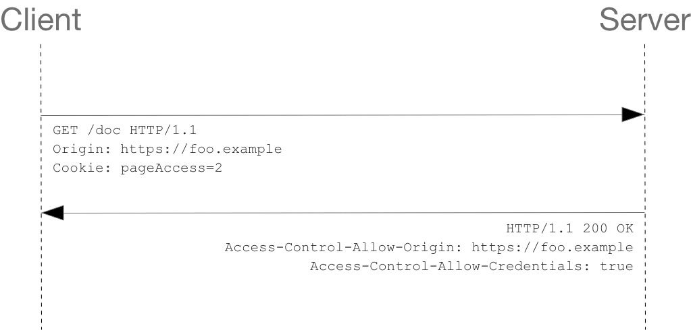

  Fetch API 提供了一个 JavaScript 接口，用于访问和操作 HTTP 管道的一部分，例如请求和响应。它在浏览器中定义在 window 接口上。

## 介绍

### fetch()

  返回一个 promise。成功时解析为 [`Response`](https://developer.mozilla.org/en-US/docs/Web/API/Response) 对象。

  promise 仅在 网络错误时 reject，不会因为 HTTP 错误(比如 404/500)而 reject。所以必须使用 `.then` 处理 HTTP 错误。

  fetch() 方法由内容安全策略(CSP)的 connect-src 指令控制，而不是它正在检索的资源的指令。

  #### 语法

  `const fetchResponsePromise = fetch(resource [, init])`

  1. resource 表示想要获取的资源。它可以是以下两种格式：

     - 一个字符串或是包含 URL 对象的对象
     - 一个 `Request` 对象

  2. init 表示可选的请求设置

     - `method` 请求方法
     - `headers` 请求头
     - `body` 请求体，只能是 `Blob, BufferSource, FormData, URLSearchParams, USVString, ReadableStream` 其中之一
     - `mode` 请求模式 `cors, no-cors, or same-origin`
     - `credentials` 控制浏览器如何处理 credentials
       - `omit` 告诉浏览器从请求中排除凭据，并忽略响应中发回的任何凭据(比如 `Set-Cookie` 头设置)
       - `same-origin` 告诉浏览器对同源 URL 的请求中包含凭据，并使用来自同源 URL 的响应中发回的任何凭据，默认设置
       - `include` 告诉浏览器在同源和跨域请求中包含凭据，并始终使用在响应中发回的任何凭据
     - `catch` 告诉浏览器如何处理 HTTP 缓存，选项同 [Request.catch](https://developer.mozilla.org/en-US/docs/Web/API/Request/cache)
     - `redirect` 如何处理一个重定向请求 `follow error manual`
     - `referrer` 请求的来源
     - `referrerPolicy` 请求来源策略
     - `integrity` 子资源完整性值
     - `signal` `AbortSignal` 实例。允许我们与 fetch 请求通信，并中止它

  #### 异常

  1. `AbortError`

    调用 `AbortController abort()` 中止请求时触发的错误
  
  2. `TypeError`

    略

### Headers

  响应/请求标头设置接口。用来构建请求头，但是一般直接使用一个普通对象表示。

### Request

  请求接口，表示请求资源对象。用来构建供 `fetch()` 使用的请求对象。

### Response

  响应接口，表示请求的响应对象。用来构建请求响应对象，更多情况下是直接处理返回的 `Response` 对象，比如 `fetch()` 返回的就是一个解析为 `Response` 对象的 promise。

  常用属性

  - `Response.status` 表示响应状态码的整数
  - `Response.statusText` 表示响应状态信息的字符串，http/2 不支持状态消息
  - `Response.ok` 表示响应状态码是否在 200-299 的布尔值

### Body

  请求和相应都可以包含 body 数据。Body 是下列类型之一：

  - `ArrayBuffer`
  - `ArrayBufferView`
  - `Blob/File`
  - string
  - `URLSearchParams`
  - `FormData`

  Request 和 Response 对象都有下列方法提取数据：

  - `Request.arrayBuffer()` / `Response.arrayBuffer()`
  - `Request.blob()` / `Response.blob()`
  - `Request.formData()` / `Response.formData()`
  - `Request.json()` / `Response.json()`
  - `Request.text()` / `Response.text()`


## CORS

  Cross-Origin Resource Sharing(CORS)，跨域资源共享。它允许服务端表明，是否可以让浏览器端跨域请求自己的资源。

  为了安全原因，浏览器严格限制跨域请求。比如，`XMLHttpRequest` 和 `fetch` 就遵守[同源策略](https://developer.mozilla.org/en-US/docs/Web/Security/Same-origin_policy)（协议、端口、域名/IP相同，则同源），它们默认只能请求同源资源，阻止跨域请求，除非服务器设置了 CORS 。

### 常见的使用 CORS 的请求

- XMR/Fetch 跨域请求
- Web Fonts（@font-face）
- img/video/audio 标签
- WebGL 纹理
- canvas drawImage()
- ...

### Simple requests 简单请求

简单请求不会触发 CORS。满足以下**所有条件**的就是简单请求：

- `GET, HEAD, POST` 之一
- 手动设置的标头只能是 `Accept, Accept-Language, Content-Language, Content-Type` 之一
- `Content-Type` 只能是 `application/x-www-form-urlencoded, multipart/form-data, text/plain` 之一

> Fetch 规范并不使用 `simple request` 概念。以上这些可以看作是大概的一些条件，不属于规范。

### Preflighted requests 预检请求

除了简单请求，对于预检请求，浏览器会先向服务器发送一个 `OPTIONS` 请求。

### Request and credentials

跨域的简单请求如果携带了凭据，比如携带了 Cookie 头。此时因为是简单请求，浏览器不会发送预检请求，但是如果服务器的响应没有 `Access-Control-Allow-Credentials: true` 头部，浏览器会拒绝掉这个响应。



#### Credentialed requests and wildcards 凭据请求和通配符

当响应一个带凭据的跨域请求时:

  - `Access-Control-Allow-Origin` 头部不能为 `*`，必须为具体的源
  - `Access-Control-Allow-Headers` 头部不能为 `*`，必须为具体的头部项
  - `Access-Control-Allow-Methods` 头部不能为 `*`，必须为具体的方法项

同时，当响应头有 `Set-Cookie`，但是 `Access-Control-Allow-Origin` 为 `*`，此时 cookie 设置不会生效，`Access-Control-Allow-Origin` 必须为具体的源。

### 相关头部

  #### Request header

  CORS 预检请求会带上三个头部

  - `origin` 
  - `Access-Control-Request-Method` 实际请求使用的方法
  - `Access-Control-Request-Headers` 实际请求携带的头部

  #### Response header

  预检请求响应会有以下几个头部

  - `Access-Control-Allow-Origin` 服务器允许的请求源
  - `Access-Control-Allow-Methods` 服务器允许的请求方法
  - `Access-Control-Allow-Headers` 服务器允许的请求携带的头部
  - `Access-Control-Allow-Credentials` 服务器是否允许实际请求携带凭据
  - `Access-Control-Max-Age` 服务器设置的允许客户端缓存响应，不用再次发送预检请求的最大时间，以秒为单位，默认为 5。Firefox 可以设置的最大值为 24 小时，Chromium（v76 之前）为 10 分钟，Chromium（v76 之后）为 2 小时。

### Preflight

  CORS 预检请求，检查服务器是否允许实际的跨域请求。
  
  预检请求是一个 OPTIONS 请求，使用三个头部字段，`Access-Control-Request-Method`, `Access-Control-Request-Headers`,`Origin`，分别表示真实请求使用的方法、头部和源。

  当请求是需要被预检的请求(to be preflighted)时，浏览器会自动发出一个预检请求。

  > PS. 常用的 CORS 库，比如 `@koajs/cors`，都专门拦截了 `OPTIONS` 请求。否则需要手动处理这类请求。

## CSP

  Content-Security-Policy，内容安全策略。它是 HTTP 一个附加的安全层，有助于检测和缓建某些类型的攻击，包括 Cross-Site Scripting（XSS，跨站点脚本）和数据注入攻击。

  CSP 被设计为向后兼容，如果浏览器不支持，会忽略它，并使用默认的同源策略（Same-origin policy）对待网页内容。

  启用 CSP，需要手动在服务器响应加上 `Content-Security-Policy` 头。或者，`<meta>` 元素也可以配置 CSP，比如:

  ```html
    <meta http-equiv="Content-Security-Policy"
      content="default-src 'self'; img-src https://*; child-src 'none';">
  ```

  CSP 允许服务器控制浏览器可以加载脚本的源，保证加载的内容来自可信任的源。

### 使用 CSP

  ```yml
    Content-Security-Policy: <policy-directive>; <policy-directive>
  ```

  `policy-directive` 由 `<directive> <value>` 组成。

  看以下例子：

  ```yml
    Content-Security-Policy: default-src 'self'
    # 表示所有内容只能来自同源

    Content-Security-Policy: default-src 'self' trusted.com *.trusted.com
    # 表示所有内容只能来自同源、信任的域名和所有信任域名的子域名

    Content-Security-Policy: default-src 'self'; img-src *; media-src media1.com media2.com; script-src userscripts.example.com
    # 在默认所有内容只能来自同源的基础上，定义了几个具体的内容类型所能加载的源
  ```

### Directives 指令列表

#### Fetch directives

  fetch 指令控制可以资源可以加载的源

  - child-src
  - connect-src
  - default-src
  - font-src
  - img-src
  - manifest-src
  - media-src
  - object-src
  - script-src
  - style-src
  
#### Document directives

  - base-uri
  - sandbox

#### Navigation directives

  - form-action
  - frame-ancestors

### Values 指令的值

- none
- self
- unsafe-inline
- unsafe-eval
- Host
- Scheme
- nonce-\*
- sha\*-\*
