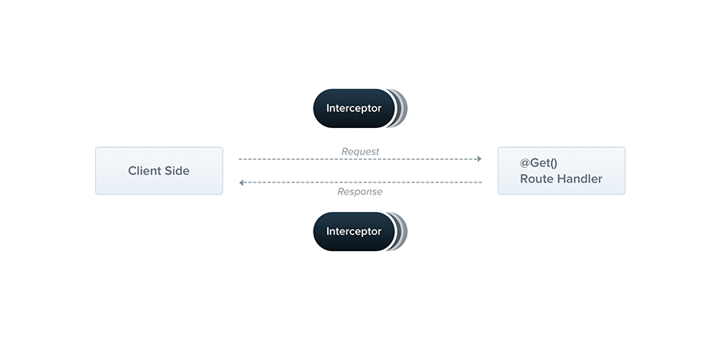

本文主要内容是 NestJS 快速上手指南，不包含详细的 API 罗列和能力介绍，如有需要可以随时查阅官方文档：https://docs.nestjs.com。

## 简介

NestJS 是一个基于 Node.js 的后端框架

## 为什么使用 NestJS

它提供了一个完善的、开箱即用的后端**架构**。支持 TypeScript、OOP(Object Oriented Programming)、FP(Functional Programming)、FRP(Functional Reactive Programming)。支持依赖注入，可以创建高度可测试、易扩展、松散耦合、易维护的后端程序。

## 核心概念

-   ### Controller

直接处理请求和返回响应的部分，使用 class 和 decorators 构建。Class 让我们使用对象编程，装饰器可以让 Nest 构建路由映射。

```jsx
// cat.controller.ts
import { Controller, Get } from '@nestjs/common';

@Controller('cats')
export class CatsController {

  @Get()
  findAll(): string {
    return 'This action returns all cats';
  }

}
```

-   ### Services

负责数据存储和获取的部分，同样使用 class 和 decorators 构建。这里的 `@Injectable()` 赋予了 CatService 可以被 Nest IoC 容器管理的特性。

```ts
// cat.service.ts
import { Injectable } from '@nestjs/common';
import { Cat } from './interfaces/cat.interface';

@Injectable()
export class CatsService {
  private readonly cats: Cat[] = [];

  create(cat: Cat) {
    this.cats.push(cat);
  }

  findAll(): Cat[] {
    return this.cats;
  }
}
```

-   ### Provider

provider 是可以作为依赖被注入的东西，Nest 中几乎所有东西都可以被当作 provider，比如上面代码中的 CatsService，就是一个 provider。

Provider 在 Controller 中消费。

```ts{9}
// cat.controller.ts
import { Controller, Get, Post, Body } from '@nestjs/common';
import { CreateCatDto } from './dto/create-cat.dto';
import { CatsService } from './cats.service';
import { Cat } from './interfaces/cat.interface';

@Controller('cats')
export class CatsController {
  constructor(private catsService: CatsService) {}

  @Post()
  async create(@Body() createCatDto: CreateCatDto) {
    this.catsService.create(createCatDto);
  }

  @Get()
  async findAll(): Promise<Cat[]> {
    return this.catsService.findAll();
  }
}
```

Provider 还需要在 Module 中注册，之后才可以被 Nest 注入到相应的地方。

```ts
// cat.module.ts
import { Module } from '@nestjs/common';
import { CatsController } from './cats/cats.controller';
import { CatsService } from './cats/cats.service';

@Module({
  controllers: [CatsController],
  providers: [CatsService],
})

export class AppModule {}
```

-   ### Modules

使用 @Module 注解的类，被 Nest 用来组织应用程序的结构， 解析模块、provider 关系和依赖。

根据 SOLID 原则，我们将相关部分放到一起，一个模块的文件结构大概会是这样：

```md
src

 |--cats

 |    |--interfaces

 |    |    |--cat.interface.ts

 |    |--cats.controller.ts

 |    |--cats.module.ts

 |    |--cats.service.ts

 |--shared/common

 |    |--filters

 |    |--interceptors

 |--app.module.ts

 |--main.ts
```

app.module.ts 是应用程序的根模块，必须存在，负责组织内部其它模块，内容如下：

```ts
// app.module.ts
import { Module } from '@nestjs/common';
import { CatsModule } from './cats/cats.module';

@Module({
  imports: [CatsModule],
})

export class AppModule {}
```

-   ### 中间件 Middleware

略

-   ### 异常过滤器 Exception filters

Nest 自带的异常捕获器，负责处理代码中未处理的异常。

比如未处理的全局异常返回、参数校验失败返回，都会经过内置的过滤器返回固定的格式。我们也可以使用过滤器自定义处理全局异常返回的格式，同时记录错误日志。

-   ### 管道 Pipe

主要做一些数据格式转换和校验的工作。

> 转换和校验其实可以在路由处理器方法中完成，但是为了**单一责任原则**，Nest 专门设计了 pipe 来处理此类工作。

```ts
// 格式转换
@Get(':id')
async findOne(@Param('id', ParseIntPipe) id: number) {
  return this.catsService.findOne(id);
}
```

参数校验

Nest 使用内置的 `ValidationPipe` 和第三方包 `class-validator` 做参数校验

```ts{4}
// 全局开启校验
async function bootstrap() {
  const app = await NestFactory.create(AppModule);
  app.useGlobalPipes(new ValidationPipe());
  await app.listen(3000);
}
bootstrap();

// controller 中定义参数类型
@Post()
create(@Body() createUserDto: CreateUserDto) {
  return 'This action adds a new user';
}
```

-   ### 守卫 Guards

基于一些条件判断一个请求是否可以被路由处理器处理，主要用于权限校验。

-   ### 拦截器 Interceptors

可以在路由函数执行之前或之后做一些事情。比如，全局成功返回的固定格式，访问日志等。



以上便是 NestJS 的一些核心概念，看完后对 NestJS 应该有了一个整体的了解，再结合对应部分的文档，便可以熟练掌握 NestJS 的使用。
