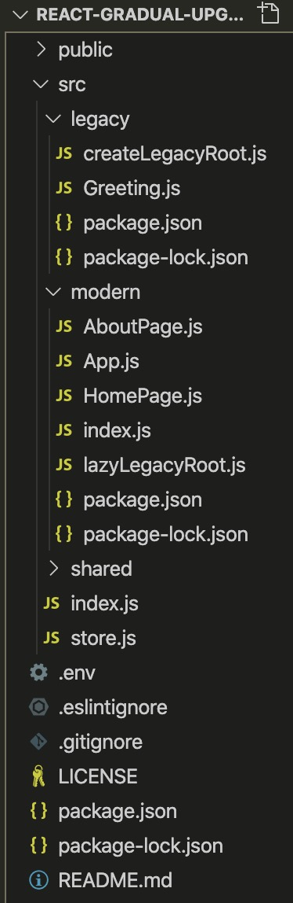
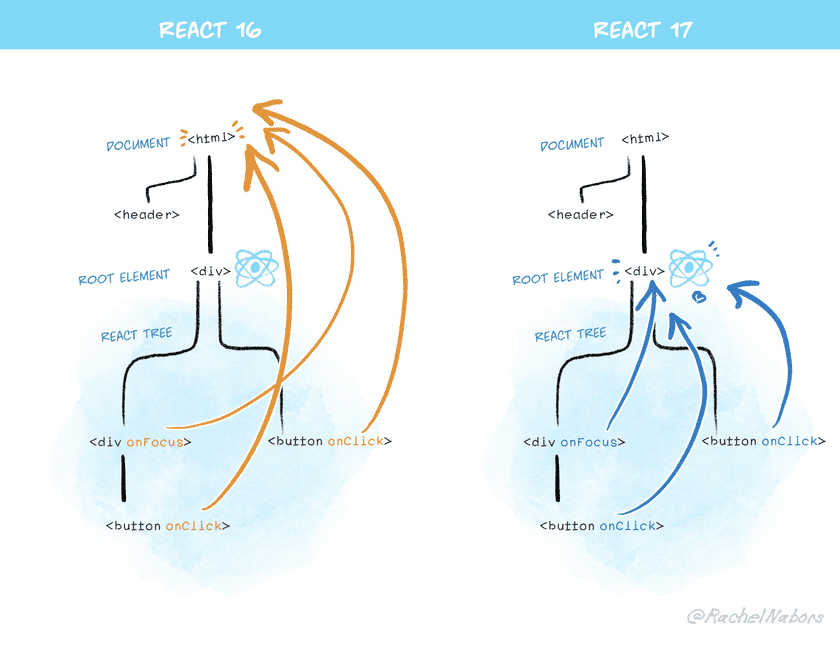

看完三篇发布文档的感受就是，
1. react 本次大版本更新强调**渐进式升级**，避免一个应用的整体修改。
2. 已有API无变化，内在有些改变。
3. 对我来说是好事，毕竟现在的原理还没搞清楚，再来新的很难顶。

下面是具体的变化：

## 无新特性
React v17.0 RC 版本发布在北京时间 8 月 11 日凌晨，距离上一次大的版本更新（HOOK 版本，2019.2），已经将近两年的时间，本次更新没有新特性，主要是**升级简化 React 本身**，为未来做准备。

## 逐步升级
当有新的版本时，可以选择部分升级，项目里可以有两个 react 的版本，**但是官方都不建议这么搞**，主要是为了么办法全量升级 react 的项目。
这里有个疑问是【项目里可以有两个 react 的版本呢？】，答案是两个 package.json ，参考官方给的逐步升级 [demo](https://github.com/reactjs/react-gradual-upgrade-demo/)，看下目录结构就清楚了



legacy 文件夹是老项目，modern 是新项目，分别有一个 package.json，里面就是对应的 react 版本和 其他依赖 react 版本的库（react-redux 等），这样打包的时候，遵循从内往外找依赖的原则，俩版本就可以共存了。

## 更改事件委托
上述的两个 react 版本共存，有一个严重的问题。react 的事件处理一直是委托到 document 处理，两个版本共存，会在顶层注册两个事件处理器，会破坏 `e.stopPropagation()`，如果一个阻止了冒泡，另一个还是会传到顶层。官方给了一个 [Atom](https://github.com/facebook/react/pull/8117) 的例子，没细看～
基于以上原因，react 改变了事件委托对位置，在 react 17 中，事件处理器将附加到渲染 React 树的根 DOM 容器中。

```jsx
const rootNode = document.getElementById('id');
React.render(<App />, rootNode)
```

17 会对事件调用 `rootNode.addEventListener`，贴张图



这样，两个版本对 react 事件体系就可以共存了

  * 解决隐患

在 React 16 中创建的 `document.addEventListener`，即使在某个事件中调用了 `e.stopPropagation`，还是会执行，因为原生事件都已经处于 document 级别。使用 React 17 冒泡将被阻止（按需），因此 document 级别的事件监听不会触发。

## 其他重大更改
  * **对标浏览器**
    * onScroll 事件「不再冒泡」，以防止出现常见的混淆。
    * React 的 onFocus 和 onBlur 事件已在底层切换为原生的 focusin 和 focusout 事件。它们更接近 React 现有行为，有时还会提供额外的信息。
      React 之前的 focus 和 blur 事件会冒泡，但是对应的原生 Dom 事件不会冒泡，而原生 DOM 的 focusin 和 focusout 事件是会冒泡的，所以切换成原生的 focusin 和 focusout 符合预期。
    * 捕获事件（例如，onClickCapture）现在使用的是实际浏览器中的捕获监听器（？不懂，浏览器引擎一类的东东？）。
  * **去除事件池**
    React 17 中移除了 "event pooling（事件池）"
  * **副作用清理时间**
    ```jsx
    useEffect(() => {
      // This is the effect itself.
      return () => {
        // This is its cleanup.
      };
    });
    ```
    副作用清理函数（如果存在）在 React 16 中同步运行，可能会在标签切换时减缓屏幕的过渡。所以在 React 17 中，副作用清理函数会异步执行，清理会在屏幕更新后执行。
    此外，React 17 会根据它们在树中的位置，以与效果相同的顺序执行清除功能。以前，顺序有时会不同。
  * **返回一致的 undefined 错误**
    「在 React 17 中，forwardRef 和 memo 组件的行为会与常规函数组件和 class 组件保持一致。在返回 undefined 时会报错」
  * **原生组件栈**
    「在 React 17 中，使用了不同的机制生成组件堆栈，该机制会将它们与常规的原生 JavaScript 堆栈缝合在一起。这使得你可以在生产环境中获得完全符号化的 React 组件堆栈信息。」
    React 17 的报错信息在 console 中可以看到是哪个组件抛出的错误，会打印出“组件栈”的信息，而且可以点击索引到代码位置，就像 js 抛出的错误那样。
    可以在 context 中设置 displayName 以改善调用栈信息。
  * **移除私有导出**

## 全新的 JSX 转换
  * 有如下源代码：
    ```jsx
    import React from 'react';

    function App() {
      return <h1>Hello World</h1>;
    }
    ```
  * 旧的 jsx 转换
    ```jsx
    import React from 'react';

    function App() {
      return React.createElement('h1', null, 'Hello world');
    }
    ```
  * 新的 jsx 转换
    ```jsx
    // 由编译器引入（禁止自己引入！）
    import {jsx as _jsx} from 'react/jsx-runtime';

    function App() {
      return _jsx('h1', { children: 'Hello world' });
    }
    ```


    参考：
    * https://mp.weixin.qq.com/s/fpcTFFnOS6JwLi7wq3OF0w
    * https://reactjs.org/blog/2020/08/10/react-v17-rc.html