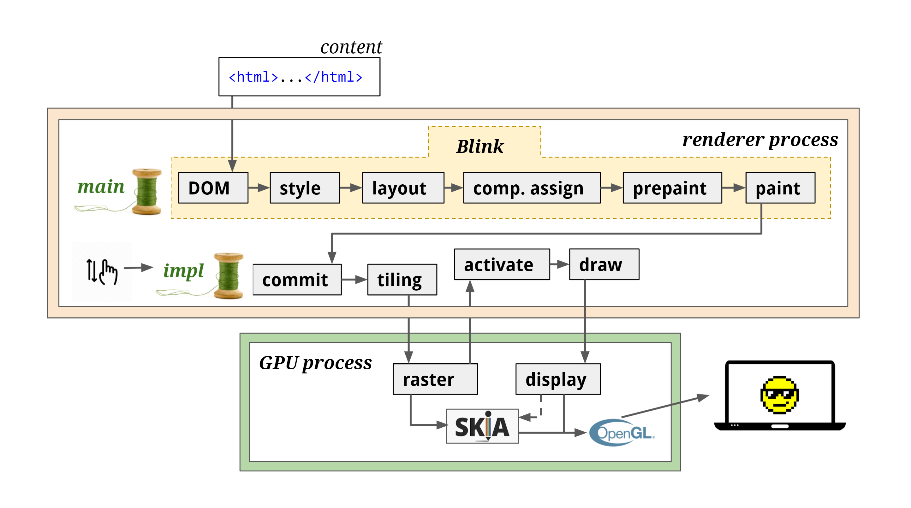
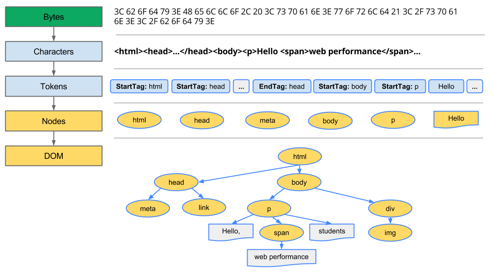
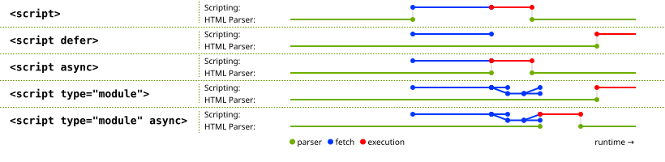

当浏览器接收到第一个数据块，它就开始解析这些数据。解析（Parsing）是浏览器把接收到的数据转换成 DOM 树和 CSSDOM 的过程。然后进入渲染流程。

浏览器将内容渲染到页面一般有5个步骤：

1. PARSE：解析 HTML，构建 DOM 树
2. STYLE：为每个节点计算最终的有效样式
3. LAYOUT：计算每个节点的位置和大小
4. PAINT：绘制不同的盒子，为了避免不必要的重绘，将会分成多个层进行处理
5. COMPOSITE & RENDER：将上述不同的层合成一张位图，发送给 GPU，渲染到屏幕上

## 浏览器渲染详细流程

Chromium 渲染流程的主要步骤如下图所示：

### Parse 解析 HTML -> DOM 树

  > 参考：https://developers.google.com/web/fundamentals/performance/critical-rendering-path/constructing-the-object-model

  - Conversion（转换）：浏览器从磁盘或网络读取 HTML 的原始字节，并根据文件的指定编码将它们转换成字符
  - Tokenization（分词）：浏览器根据 HTML5 规范将字符串转换成元素标记
  - Lexing（语法分析）：将元素标记转换为相应的元素对象，对象包含元素的名称、属性、文本等信息
  - DOM construction（DOM 构造）：元素标记的包含关系，对象也有相应的父子兄弟关系，通过这些关系构造出 DOM 树

  构建 DOM 的流程如下：

  

  子资源加载

  当解析器遇到非阻塞资源，比如一个图片、css 文件，浏览器会向缓存或网络请求这些资源，然后继续解析。但是如果这些资源是阻塞的，比如没有 `async`/`defer` 属性的，在 body 标签之前的 script，会打断解析 HTML，转而开始加载、解析和执行 JS。

  浏览器为了加快资源请求，做了一个优化 —— **`preload scanner`**，在解析 HTML 时，它会并发地扫描页面中的资源，如果遇到子资源，就向浏览器进程中的网络线程发送请求。

### Style 样式计算

  处理 CSS，构建 CSSOM 树。CSSOM 树和 DOM 树是独立的数据结构，这俩是并行构建的，但是 CSSOM 会阻塞 JS 的执行，因为 JS 可能会操作样式信息。

### Layout

  DOM 树和 CSSOM 树合并成渲染树，包含了屏幕上的所有可见内容及其内容信息。下一步，再计算每个节点在设备视口内的确切位置和大小，也就是布局计算。

  第一次确定节点的大小和位置称为布局（Layout），随后对节点大小和位置的重新计算称为重排（reflow，也叫回流）。假设初始布局发生在图像返回之前，由于我们没有声明图像的大小，因此一旦知道图像大小，就会进行重排。

### Paint

  绘制阶段，会首先根据 CSS 层叠上下文规范，建立层叠上下文，也就是垂直方向的绘制顺序，按照从下往上的顺序绘制。

### Compositing

  合成是一种技术，可以将页面的各个部分分成图层，分别将它们光栅化，然后在称为合成器线程的单独线程中合成为页面。如果发生滚动，由于图层已经被光栅化，它所要做的就是合成一个新的帧。

  合成的优点是它在不涉及渲染主线程的情况下完成的。合成器不需要等待样式计算或 JavaScript 执行。只和合成相关的动画被认为是获得流畅性能的最佳选择。如果需要再次计算布局或绘制，则必须涉及主线程。

  > [Chrome devtool Layer Panel](https://blog.logrocket.com/eliminate-content-repaints-with-the-new-layers-panel-in-chrome-e2c306d4d752/?gi=cd6271834cea)

## 渲染优化

优化影响渲染的资源

在浏览器解析 HTML 的过程中，CSS 和 JS 都有可能对页面的渲染造成影响。优化方法包括以下几点：

1. 关键 CSS 资源放在头部加载。
2. JS 通常放在页面底部。
3. 为 JS 添加 async 和 defer 属性。
4. body 中尽量不要出现 CSS 和 JS。
5. 为 img 指定宽高，避免图像加载完成后触发重排。
6. 避免使用 table, iframe 等慢元素。原因是 table 会等到它的 dom 树全部生成后再一次性插入页面中；iframe 内资源的下载过程会阻塞父页面静态资源的下载及 css, dom 树的解析。

## 重绘和重排

1. 当我们引入强制浏览器重新计算元素的位置或几何形状的更改时，就会发生**重排** — 触发布局、绘制和合成步骤。获取布局信息时，也会导致重排。相关的方法属性如 `offsetTop`, `getComputedStyle` 等。

2. 当我们的更改仅影响 Paint 属性时，就会引入重绘 — Paint 和 Compositing 都必然会被触发。例如，我们可以在更改 `background-color` 或 `box-shadow` 属性时看到重绘。

避免减少重绘和重排

1. 对 DOM 进行批量写入和读取
2. 避免对样式频繁操作，了解常用样式触发重绘和重排的[机制](https://csstriggers.com/)
3. 合理利用特殊样式属性（如 transform: translateZ(0) 或者 will-change），将渲染层提升为合成层
4. 使用变量对布局信息（如 clientTop）进行缓存，避免因频繁读取布局信息而触发重排和重绘

> ##### 参考：
> 本篇主要是参考 《剑指前端 offer》的学习笔记，有需要可以参考原文。
> 
> 1. https://febook.hzfe.org/awesome-interview/book2/browser-render-mechanism
> 2. https://febook.hzfe.org/awesome-interview/book1/browser-repain-reflow
